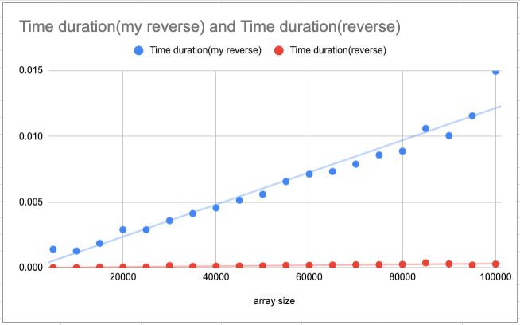
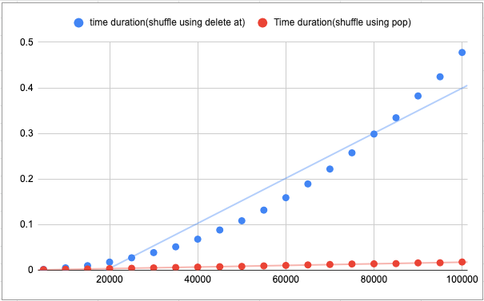

# Algorithmic Complexity #

This project dives into the world of algorithms, on a quest to better understand complexity, and how I can improve the speed and efficiency of the code I write.

Every machine deals with processes in the same way, however the type of process you ask a computer to execute is crucial to how efficient it runs. Two algorithms may garner the same result, but may differ in the sequence of instructions used to reach the result.

the sequence is important as it dictates how the computer interacts with its memory and retrieves info. In each cell of memory, bits and bytes are stored with an address so the computer can access that information without having to go through each cell. Algorithms become inefficient when we ask the computer to execute a process that cause changes to the composition of the information stored in the memory (e.g delete_at in array which causes the array to be remapped, as apposed to pop which simply takes off the end of the array).

## Timing Framework ##

To better understand the efficiency of algorithms, I created this simple timing framework.

To set up:

clone this repository, then:

```
cd algorithms
```

add the algorithm that you'd like to time in to the 'run_algorithm' method on line 70 of the framework.  (there is already a reverse method as a default algorithm)
then:

```

timing_framework = TimingFramework.new
timing_framework.run

```

then go into the RESULT file that is created in the folder.
Copy the raw data into [this spreadsheet](https://docs.google.com/spreadsheets/d/1tAQsbwW03yUB7ikF3Z7I8RVRVS3PFz5eWlNSX0Q0Wcc/edit?usp=sharing).


## Findings ##

Reverse




#### Shuffle ####




The shuffle method using the delete_at operation is way more inefficent, as it requires the array to be remapped on every iteration, therefore changing the composition of the array. The curve is quadratic because the costly operation is happening inside a loop, so there are x² the number of processes going on when you double the input size.  

It is better get the element you want to delete to the end of the array, then to use the pop method. This doesnt require a remapping of the array and the time difference by making such a minor change is remarkable. 
